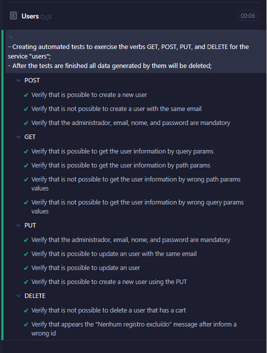
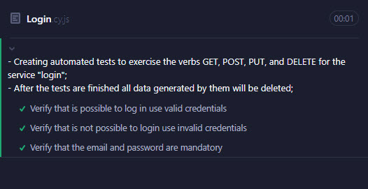
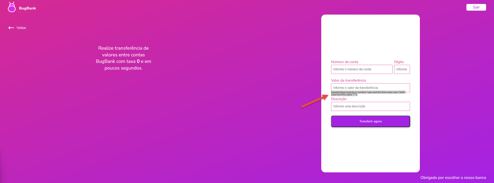

# verifymy_challenge
## Index

- [Introdution](#Introdution)
- [Automation Challenge](#Automation-Challenge)
- [Used technologies](#used-technologies)
- [Run test](#run-test)
- [Final Considerations](#final-considerations)
---
## Introdution 

The goal is to create a project showcasing my expertise in ensuring the quality and reliability of software applications using the Cypress framework.

>Key Features:
* UI Tests: These tests cover main scenarios, navigation, and result verification. By simulating user interactions, I ensure the seamless functioning of the selection process from the user's perspective.
* API Tests: These tests focus on validating the functionality and integrity of the selection process at the backend level. I verify the accuracy of API endpoints, data processing, and responses.

>Benefits:
* Efficient and Accurate Testing: By automating the UI and API testing, I can conduct tests quickly and accurately, saving time and reducing the possibility of human error. This approach allows me to deliver reliable results consistently.
* Thorough Validation: The test suite provides comprehensive coverage, considering potential error scenarios. I have designed it to ensure that all critical aspects are validated, guaranteeing the application's reliability and performance.
* Enhanced Quality Assurance: The automated testing of both the UI and API aspects enables me to identify and rectify issues proactively, delivering an exceptional user experience.

By utilizing this advanced UI and API test suite, I demonstrate my dedication to ensuring the highest standards of quality and efficiency.

## Automation Challenge

> Remarks requested

The intention is not the quantity of coverage, but rather to use this opportunity to demonstrate knowledge and skills in quality, organization, workflow, attention to security, generation and cleanup of test data (when possible), documentation, and development best practices
* Use best practices;
* The test should be repeatable;

>1° part:

 Create automation tests for APIs(https://serverest.dev), exercising the verbs, using best practices:
* GET;
* POST;
* PUT;
* DELETE;

It's necessary after the tests, to delete the data generated by them. 

`Thirteen automated tests were created for the "users" service, and three tests for the "login" service. The "users" service was chosen to provide coverage based on its service requirements.`

 

>2° part:

Create test cases for BugBank: https://bugbank.netlify.app/ in your preferred format:
* checklist;
* mind maps;
* etc.

`Here is a brief planning for the bugbank's test` https://mm.tt/app/map/2857086439?t=YKP6QvU4sW


Record any defects or improvements found during the process.

`Here are some effects or improvements that I found during the process
* BugBank
  * It is possible to fill letters in the "account number" and "digit"  fields on the transfer forms.
  * The "account number" and "digit" fields are not mandatory on the transfer forms.
  * When creating a new account, if accessing the Register screen again to create a second account, the values previously entered are not cleared after the account has been created.
  * It is possible to perform a transfer without entering the "digit".
  * There is no exception handling for the "transfer value" field.

* Serverest
  * The "administrator" attribute in the user service is currently typed as a string, but it would be more appropriate to use a boolean.
  * It is possible to delete a user without providing a valid token.
  * It does not make sense to search for users by including the password as a query parameter in the service.

>3° part:

 Create automation tests for the user interface (UI).

- Register two new accounts (with balances).
- Perform login.
- Transfer money from account 1 to account 2.
- Verify the balance in all accounts.
- Log out.

`Demonstration of the scenario applied in the UI automated test.`

```gherkin
# Author: Lucas Matheus de souza Pereira
# language: en
@cypress @javascript @bugBank
Feature: Register new accounts

  Background:
    Given I am on the bugbank page
    And I want to create "2" user accounts with balance
    When I log in using the user number "1" credentials
    Then the page should show the user number "1" information

  @createUserAccount @transfer @E2E
  Scenario: Create 2 user accounts, send a transfer for them, and check the transfer details on the statement in both user accounts
    When I transfer "500" to user account "2"
    Then the modal should show "Transferencia realizada com sucesso" message
    And the page should show the "500,00" of Balance left
    And the system should show transfer details on the statement
      | transactionType       | TransactionDescription          | transactionValue | availableBalance |
      | Abertura de conta     | Saldo adicionado ao abrir conta | R$ 1.000,00      | R$ 500,00        |
      | Transferência enviada | cypress automation              | -R$ 500,00       | R$ 500,00        |
    Given I click on log out button
    When I log in using the user number "2" credentials
    Then the system should show transfer details on the statement
      | transactionType        | TransactionDescription          | transactionValue | availableBalance |
      | Abertura de conta      | Saldo adicionado ao abrir conta | R$ 1.000,00      | R$ 1.500,00      |
      | Transferência recebida | cypress automation              | R$ 500,00        | R$ 1.500,00      |

```


## Used technologies 
---
For this challenge, The following technologies were used:
- Javascript
- Cucumber
- Cypress
- Node
---

## Run tests

To run the project, just go in your favorite terminal to the project directory and execute the following command:

This command installs a package, and any packages that it depends on.
```bash
  $ npm install
```
This command is responsible for running the tests.
```bash
  $ npx cypress open
or
  $ npx cypress run
```
---
## Final Considerations
```
In summary, the challenge was funny, I was able to apply some techniques in the tests and try to make it as simple as possible. 
I hope I was able to show what was requested.
```
[Go To TOP](#TOP)


